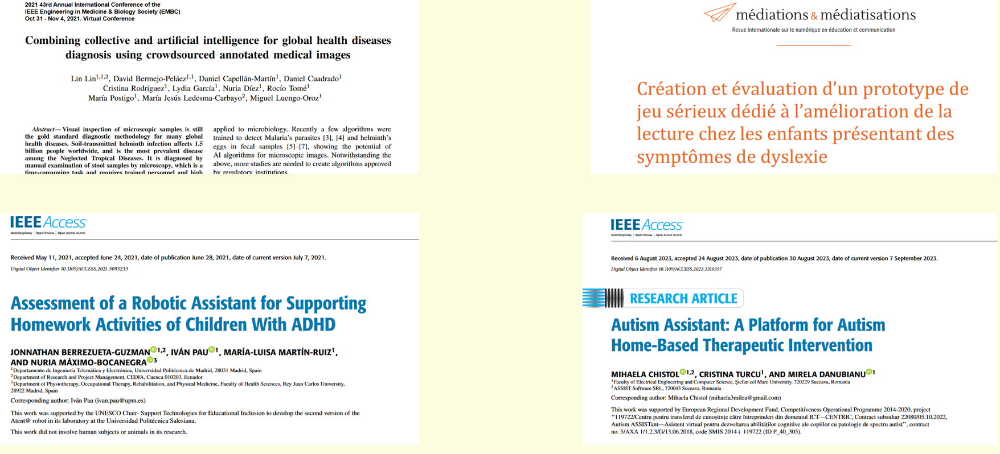
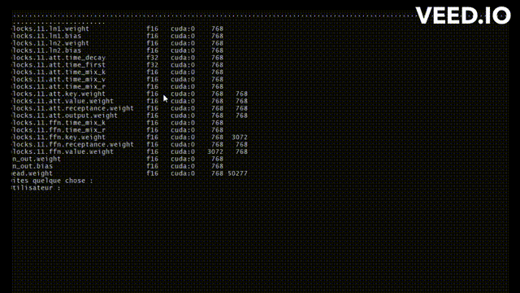
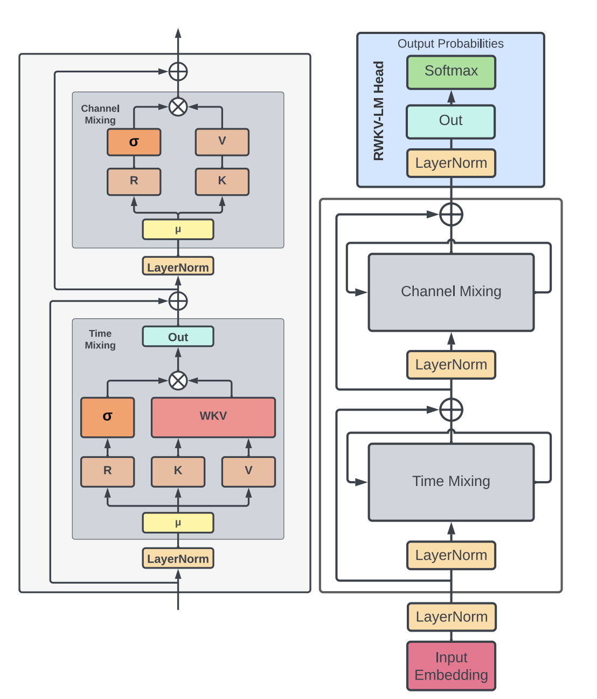
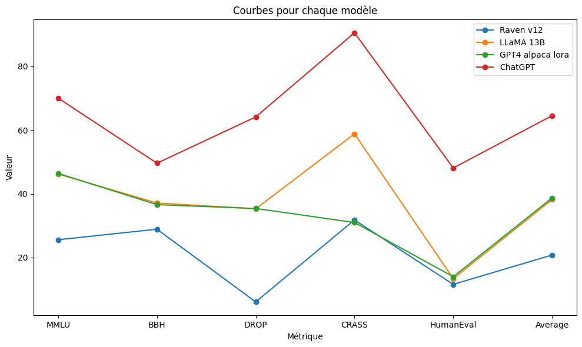

</a> 
</a> 


# Global App Functionalities

## Overview

Avatario is a comprehensive mobile application designed to engage children through a customizable avatar. This avatar grows and evolves as children interact with various games and activities within the app. The primary goal of Avatario is to provide a fun and interactive learning environment while simultaneously offering tools for parents to monitor and understand their children's developmental progress.

## Key Features

- **Customizable Avatars:** Children can personalize their avatars, making the learning experience more engaging and relatable.
- **Diverse Games and Activities:** A wide range of games is available, each focusing on different skill sets, including cognitive, emotional, and social development.
- **Parental Dashboard:** Parents can access the app to track their child's progress, identify learning difficulties or emotional challenges, and receive tailored advice.
- **Educational Insights:** The app provides insights and tips for parents to better support their child's learning journey.

## Reaserches 
we based ourselves on reachers to make this App , and relations between *games perferomance* and *Medcial/psycholigcal heealth issues* : 
</a> 

# Child Mode: Games and Psychological Insights

## Interactive Learning through Games

In Child Mode, Avatario offers a variety of games designed to be both fun and educational. These games cater to different age groups and learning stages, ensuring a tailored experience for each child.

## Games and Their Psychological Benefits

- **Cognitive Development:** Games focused on memory, problem-solving, and critical thinking help in enhancing cognitive abilities.
- **Emotional Intelligence:** Activities that involve understanding emotions, empathy, and communication contribute to emotional maturity.
- **Social Skills:** Interactive games that encourage collaboration, sharing, and teamwork help in developing social skills.

## Relationship to Psychological and medical Well-Being

- **Identifying Learning Difficulties:** Games are designed to subtly assess and flag potential learning difficulties, providing early intervention opportunities.
- **Emotional Health Monitoring:** Through gameplay patterns and interactions, the app can help identify emotional distress or behavioral changes.
- **Parental Guidance and Support:** The app offers resources and guidance for parents to address identified challenges effectively.


# Avatario Chat Bot: Fine-Tuned with Medical Data
for the moment , the Avatrio_Chat_Bot is not fully implemented in the mobile app 
but heres a CLI test : 
</a> 


The Avatario chat bot is a cutting-edge component of the Avatario app, leveraging the RWKV language model developed by BlinkDL. This model uniquely combines RNN and Transformer architectures, offering high performance without the typical computational demands of self-attention mechanisms.

## Fine-Tuning for Medical Relevance

To tailor the chat bot for Avatario's specific needs, particularly in addressing children's health and emotional well-being, it underwent a specialized fine-tuning process. This fine-tuning was conducted on a unique dataset, "training.txt," comprising medical data carefully curated by our team. The dataset focuses on pediatric health, emotional intelligence, and child psychology, ensuring the chat bot's responses are relevant and sensitive to children's needs.

Fine tuning demo : 
</a> 


## Utilization of Google Colab for Training

Due to resource constraints on our local machines, the fine-tuning of the RWKV model for the Avatario chat bot was performed on Google Colab. This approach allowed us to leverage more powerful computational resources remotely. The fine-tuning process was conducted following the procedure outlined in the RWKV v4 RNN Pile Fine Tuning notebook, available at this URL: [RWKV Fine Tuning on Colab](https://colab.research.google.com/github/resloved/RWKV-notebooks/blob/master/RWKV_v4_RNN_Pile_Fine_Tuning.ipynb#scrollTo=wW5OmlXmvaIU).

## Integration into Avatario

Incorporating the RWKV model, fine-tuned with our specialized medical dataset, the Avatario chat bot stands as a technologically advanced tool. While the core architecture of RWKV and its efficiency in handling large context lengths (ctx_len) are detailed later, it's important to note that these features significantly contribute to the chat bot's capability to provide contextually relevant and medically insightful interactions.


# Directory structure :
```
                 
│20B_tokenizer.json                                                
│convert_model.py                                     
│RavenApi.py                                               
│RavenCloud.py                                           
│Avatario.ipynb                                              
│
├───├instructions
│       ProjectAdvisor.py                                            
│                                                   
│
└───├users                                                                                                 
```
### Explications :

-20B_tokenizer.json: The model's tokenizer, essential for processing text inputs.

-convert_model.py: A strategy model converter that optimizes and speeds up the model loading process.

-RavenApi.py: The implementation of the Raven model as an API, enabling seamless integration with other applications.

-RavenCloud.py: A CLI (Command-Line Interface) for interacting with the Raven model directly via the terminal.

- Avatario.ipynb: A Jupyter notebook for running the model. Note that the terminal is required for execution.


### instructions folder :

-ProjectAdvisor.py: An initial prompt that guides the model to function as a Medical assistant.


Restricting the model to specific use cases allows for better control and performance.
### users folder :

The "users" folder contains directories for individual Parents, each containing their respective conversations.


# Chatbot Explanation :

The primary objective of this project was to explore the capabilities of the generative text model called RAVEN in its version 4, driven by an open-source community. Additionally, it aimed to assess the model's vision regarding future outputs and projects.

# Avatario ChatBotimplementation :
### Prerequirments
Python 3.4+                                                       
Virtualenv                      
pip

### Installation
```
apt-get install -y git
```

```
git clone https://github.com/khhaliil/ Avatario.git
```
All of the following will be built into a virtualenv

open the cmd in the root folder
do : 
```
cd ../

```

Then do the follow:
linux :
```
sudo apt-get update
sudo apt-get install python3-venv
python3 -m venv myenv

```
windows : 
```
pip install virtualenv
python -m venv myenv

```
Then activate the environnement

windows : 
```
venv\Scripts\activate
```


linux : 
```
source venv/bin/activate
```
You can install the required Python libraries by running:

```
pip install rwkv
pip install torch
pip install pynvml
pip install fastapi
pip install pydantic
pip install mysql
pip install ninja

```
you can dowload the RAVEN V12 14B Params from this [Link](https://huggingface.co/BlinkDL/rwkv-4-raven/resolve/main/RWKV-4-Raven-14B-v12-Eng98%25-Other2%25-20230523-ctx8192.pth)

Make sure to put the model in the RavenApi folder


Make sure to install CUDA :       
 [Linux](https://docs.nvidia.com/cuda/cuda-installation-guide-linux/)
 [Windows](https://docs.nvidia.com/cuda/cuda-installation-guide-microsoft-windows/)

### Usage
To use cuda acceleration please do : 

linux: 

```
export PATH=/usr/local/cuda/bin:$PATH
export LD_LIBRARY_PATH=/usr/local/cuda/lib64:$LD_LIBRARY_PATH
```

windows:

Install VS2022 build tools (https://aka.ms/vs/17/release/vs_BuildTools.exe select Desktop C++). Reinstall CUDA 11.7 (install VC++ extensions). Run v2/chat.py in "x64 native tools command prompt". 


you can see other strategy options [HERE](https://github.com/BlinkDL/ChatRWKV/blob/main/ChatRWKV-strategy.png)

RWKV python implementation can be found [HERE](https://pypi.org/project/rwkv/)


# RavenCloud

```
cd  Avatario/RavenApi
python RavenApi.py
```


### Performance 

Here because we have no time nore ressources we used RWKV RAVEN 4 196M parameterts but in the future we will use the 7B version :
heres why :

The 7B model performs exceptionally well on Google Colab's NVIDIA V100 and Tesla T4, consuming 20 GB of RAM for loading and 16 GB of VRAM. The strategy used for this model is CUDA FP16, with the first layer on the CPU and layers 2 to 33 on the GPU.

The 14B model performs well on Vast.ai instance 2X RTX 4000, consuming 30 GB of RAM for loading and 32 GB of VRAM. The strategy used for this model is CUDA 0:FP16 -> CUDA 1:FP16, with the first layer on the CPU, layers 2 to 16 on GPU 1, and layers 17 to 33 on GPU 2.

# Why Raven ? 

RWKV sounds like an impressive language model developed by BLINKDL that combines the strengths of both RNN and Transformer architectures. By blending these two approaches, RWKV achieves results similar to a Transformer-based language model, providing high performance while being directly trainable in a manner similar to a GPT-style Transformer (parallelizable).

One notable advantage of RWKV is that it is entirely attention-free, meaning it does not rely on self-attention mechanisms that are typically resource-intensive. Instead, to calculate the hidden state at position t+1, RWKV only requires the hidden state at position t. This design choice leads to efficient memory usage, making it particularly suitable for NV-RAM (Non-Volatile Random Access Memory) environments.

Additionally, by utilizing the "GPT" mode, it becomes possible to quickly compute the hidden state for the "RNN" mode. This further enhances training speed and efficiency.

Overall, RWKV appears to offer exceptional performance, reduced NV-RAM memory usage, fast training, and the potential for an "infinite" ctx_len (context length). This combination of features makes it a promising and powerful language model.
## RWKV definition 

RWKV is an attention mechanism used in the context of language models, particularly in Transformers. It stands for:

R - Reference : The letter "R" represents the linear reference. The reference is calculated by linearly combining elements of the sequence using learned weights. It serves as a point of reference for evaluating the importance of other elements in the sequence when calculating attention scores.

W - Weights : The letter "W" refers to the weights used to linearly combine the elements of the sequence to calculate the reference. These weights are learned during the model training and are used to assign relative importance to each element of the sequence when constructing the linear reference.

K - Key : The letter "K" represents the keys associated with the elements of the sequence. Keys are used to measure the similarity between each element of the sequence and the linear reference. Attention scores are calculated by comparing the keys with the reference.

V - Value : The letter "V" represents the values associated with the elements of the sequence. Values correspond to the information that needs to be aggregated or represented when calculating attention. They are weighted by the attention scores and aggregated to form the final attention representation.

In summary, RWKV is a method of calculating attention in a Transformer model, where a reference is derived from the sequence elements using learned weights (W) and compared to the keys (K) to compute attention scores. The corresponding values (V) are then combined based on these attention scores to produce the final attention representation. This mechanism allows the model to focus on relevant parts of the input sequence during processing.

## RWKV  better than QKV

Reduced Complexity: RWKV Linear-Attention can be more computationally efficient compared to QKV-Attention, as it uses a linear reference instead of a combination of queries, keys, and values. This can be advantageous in terms of execution speed and resource utilization.

Capturing Long-Distance Dependencies: RWKV Linear-Attention is designed to better capture long-distance dependencies in a sequence. By using a linear reference, it can consider more complex relationships between elements, which can be beneficial in tasks where long-distance relationships are crucial.

Reduction of Positional Bias: In QKV-Attention, queries and keys may be sensitive to the position of elements in the sequence, leading to positional bias. RWKV Linear-Attention, with its linear reference, can reduce this bias and improve the model's robustness.


## Raven Architecture

</a> 


## Evaluation

| Model           | Foundation | Parameters (B) | MMLU | BBH  | DROP | CRASS | HumanEval | Average |             
|-----------------|------------|----------------|------|------|------|-------|-----------|---------|             
| Raven v12       | RWKV       | 14             | 25.6 | 28.9 | 6.1  | 31.8  | 11.6      | 20.8    |             
| LLaMA 13B       | LLaMA      | 13             | 46.2 | 37.1 | 35.3 | 58.8  | 13.4      | 38.2    |             
| GPT4 alpaca lora| LLaMA      | 30             | 46.4 | 36.6 | 35.4 | 31.0  | 14.0      | 38.7    |           
| ChatGPT         | GPT-3.5    | 70             | 70.0 | 49.6 | 64.1 | 90.5  | 48.1      | 64.5    |           

</a> 

## Metrics understanding

-MMLU (Memory Model Load Utilization): This metric measures the memory usage of the model in gigabytes (GB). It indicates the amount of memory required to load the model into the system.

-BBH (Billion BERT Operations per Hour): BBH measures the number of BERT (transformer-based neural network) operations performed by the model each hour, in billions. This metric is used to evaluate the processing speed of the model.

-DROP (Data Retrieval Operations per Hour): DROP measures the number of data retrieval operations performed by the model each hour. It is typically a measure of how quickly the model can access and retrieve the necessary data for processing.

-CRASS (Custom Reasoning Accuracy and Speed Score): CRASS is a composite metric that evaluates both the accuracy and speed of custom reasoning of the model. It combines criteria of accuracy and speed to assess the model's performance on specific reasoning tasks.

-HumanEval (Human Evaluation Score): This metric indicates the scores given by human evaluators to assess the quality and relevance of the responses provided by the model. Human evaluation is often conducted to evaluate the model's real-world performance in terms of adequacy, coherence, and overall response quality.

Average: This column represents the average scores of different metrics for each model.

### Evaluation conclusion

-Parameters (B):
Raven v12 has only 14 billion parameters, which is much less than ChatGPT's 70 billion. Fewer parameters can imply more efficient hardware resource management and quicker model utilization.

-MMLU (Mean Words Per Language Unit):
Raven v12 has an MMLU of 25.6, while LLaMA 13B and GPT4 alpaca lora have higher values, 46.2 and 46.4 respectively. A lower MMLU may indicate the ability to express ideas more concisely and understandably.

-BBH (Blind Baseline Human):
Raven v12 scores 28.9 for BBH, while GPT4 alpaca lora scores 36.6. A higher BBH score suggests that Raven v12 is closer to human responses than GPT4 alpaca lora.

-DROP (Reading Comprehension of Paragraphs):
Raven v12 scores 6.1 for DROP, whereas ChatGPT scores 64.1. This could indicate that Raven v12 is less likely to produce inaccurate or irrelevant responses when dealing with reading passages.

-CRASS (Comprehensive Reasoning on a Simple System):
Raven v12 scores 31.8 for CRASS, while GPT4 alpaca lora has a similar score of 31.0. Hence, Raven v12 is as competent as GPT4 alpaca lora in reasoning about simple systems.

-HumanEval (Human Evaluation):
Raven v12 scores 11.6 for HumanEval, while GPT4 alpaca lora scores 14.0. A higher HumanEval score for Raven v12 suggests that it is better perceived by human evaluators.


# Conclusion on the Avatario ChatBot

Raven v4, a model based on the foundation of RWKV-4 has a promising architecture, however, the version of its weights trained by the community is not very powerful, the model can perform basic tasks like writing SQL queries and simple code in Python or Java for example, but if you want to use it as a project structure it will not be able to guide you very well, because of its obsolete training data. Nevertheless, it's a good model for understanding and following the thread of a discussion. The important thing is that the model has an architecture that favors its low-cost training and that with well-chosen custom training data, it can be worth a gpt-3.5 or even better and more specialized, depending on your data.


# Conclusion: Avatario - A Comprehensive App for Child Development and Parental Engagement

Avatario stands out as a groundbreaking mobile application, uniquely designed to foster child development through interactive games and a personalized avatar system. The app intelligently analyzes game performance to offer insights into each child's learning and emotional growth. This data-driven approach not only engages children in a fun and educational manner but also serves as a crucial tool for monitoring developmental progress.

## Interactive Learning and Performance Analysis

At its core, Avatario is built around an array of games that are both entertaining and educational. These games are tailored to develop various skills, including cognitive abilities, emotional intelligence, and social interaction. The app meticulously tracks and analyzes each child's performance in these games. This analysis helps in identifying strengths, uncovering potential learning difficulties, and even flagging signs of emotional distress. The sophisticated algorithm behind Avatario ensures that the feedback provided is both accurate and beneficial for the child’s development.

## Parental Involvement and Insights

One of the most significant features of Avatario is the empowerment it offers parents. Through a dedicated dashboard, parents can access detailed reports on their child's game performances and overall progress. This feature enables parents to be more involved in their child's learning journey, providing them with a clearer understanding of their child's needs and abilities.

The integration of a fine-tuned chat bot, leveraging the RWKV language model, adds another layer of interactivity and support. Parents can interact with the chat bot to gain insights into their child's development, receive advice on how to address specific issues, and understand the psychological aspects behind their child's interactions with the app. The chat bot, enriched with medical data, acts as a bridge between technical performance metrics and practical parental guidance.

## Project Relevance and Impact

Avatario is not just an app; it's a comprehensive tool that addresses a crucial need in today's fast-paced and technology-driven world. By merging advanced AI with child psychology and educational theories, it creates a nurturing environment for children to learn and grow. For parents, Avatario demystifies the complexities of child development, offering a user-friendly platform to support their parenting journey.

In summary, Avatario is a testament to how technology can positively impact education and child development. Its innovative approach to learning, combined with the ability to provide parents with actionable insights, makes it a pioneering tool in the realm of educational technology. With its intelligent game performance analysis and the supportive chat bot, Avatario is set to transform the way children learn and how parents participate in their growth and development.


Check the paper RWKV: Reinventing RNNs for the Transformer Era [HERE](https://arxiv.org/abs/2305.13048)

# Possibilities 

# Possibilities for Future Development

Avatario, with its innovative approach to child development and parental engagement, has immense potential for growth and expansion in various areas. Here are some of the key possibilities for future development:

## Full Training of the Model

- **Enhanced Learning Algorithms:** The full training of the model with more diverse and extensive datasets can significantly improve its accuracy and responsiveness. This could involve incorporating a broader range of educational and psychological data, allowing the app to provide more tailored experiences and advice.
- **Advanced Personalization:** Enhanced training could lead to more sophisticated personalization features, where the app adapts not just to the child's learning style and pace, but also to their emotional and social development needs.

## Complete Integration with the App

- **Seamless Chat Bot Integration:** The full integration of the chat bot within Avatario can offer real-time assistance and feedback to both children and parents. This could include instant responses to children's queries during games and real-time advice to parents based on their child's app activities.
- **Game-Chat Bot Symbiosis:** A deeper integration between the games and the chat bot could lead to a more cohesive experience. The chat bot could use data from the games to provide personalized learning tips and emotional support, making the learning process more effective and enjoyable.

## Addressing a Wider Range of Health Issues

- **Broader Health Focus:** Expanding the app's focus to cover a wider range of health issues, including physical health and well-being, could provide a more holistic approach to child development.
- **Collaboration with Health Professionals:** Partnering with pediatricians, psychologists, and educators to include their insights in the app's database could enhance its capability to identify and address various health and developmental issues.
- **Parental Education:** The app could offer resources and modules to educate parents on various health conditions, developmental milestones, and effective parenting strategies.


# Credits : 
 Credits for the RWKV-4-Raven model goes to [BlinkDL](RWKV-4-Raven)                                       
 


